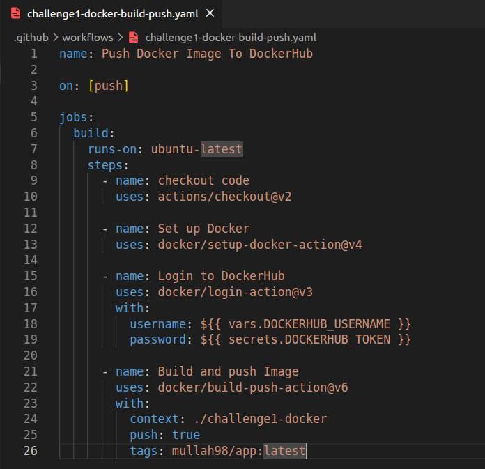
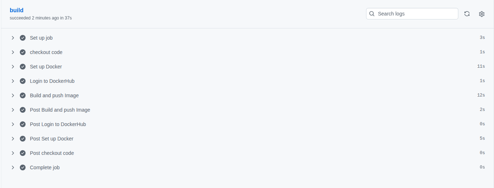

# Docker Build & Push Pipeline

## What I Built
A GitHub Actions **CI/CD workflow** that automatically:
- Logs into Docker Hub
- Builds a Docker image from a Dockerfile
- Pushes the image to Docker Hub

The application itself is intentionally minimal. The main goal of this challenge was to **practice automating container workflows using GitHub Actions**.

## Pipeline Workflow
The workflow is defined in: `.github/workflows/challenge1-docker-build-push.yml`.

**Key steps:**
- Checkout repository code
- Set up Docker on the runner
- Log in to Docker Hub using GitHub Secrets
- Build the Docker image
- Push the image to Docker Hub (`mullah98/app:latest`)

## Screenshots
1. **Workflow YAML file**  

2. **GitHub Actions workflow run**  

3. **Docker image running locally**  

## What I Learnt
- How to set up a **CI/CD pipeline** in GitHub Actions to build and push Docker images.
- Using **GitHub Secrets** for credentials securely.
- Specifying the **build context** in `docker/build-push-action` when the Dockerfile is in a subfolder.
- Verifying images both in Docker Hub and locally.

## Issues Solved
- Workflow failed initially because the Dockerfile was in a subfolder; solved by adding `context: ./challenge1-docker` in the build step.
- Learned the difference between `vars` and `secrets` for storing sensitive credentials.
