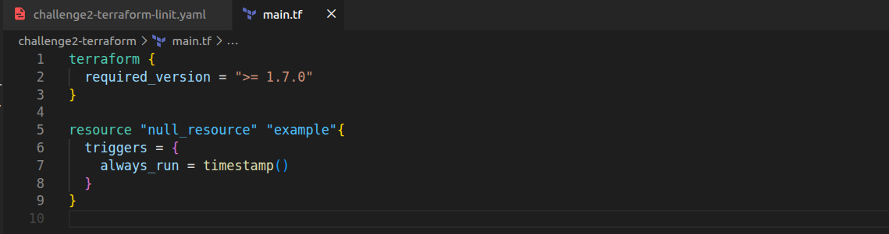

# Terraform Linting Pipeline

## What I Built
A GitHub Actions workflow that automatically **checks Terraform code** for formatting and syntax whenever a pull request is created.  
This ensures any Terraform code pushed to the repository is **linted and validated** before merging.

## Pipeline Workflow
The workflow is defined in: `.github/workflows/challenge2-terraform-lint.yml`

### Workflow Steps
1. Triggered on **pull request** to `main`  
2. Checkout the repository code  
3. Set up Terraform on the runner  
4. Run `terraform init`  
5. Run `terraform fmt -check` to validate formatting  
6. Run `terraform validate` to check syntax  
7. If any step fails → workflow fails and the PR is blocked  

## Screenshots
1. **Workflow YAML file**

2. **Faulty Terraform code** – example of intentionally misformatted code

3. **Failed GitHub Actions run** – demonstrates workflow catching formatting errors

4. **Fixed Terraform code** – corrected formatting

5. **Successful GitHub Actions run** – shows workflow passing after fix  

## What I Learnt
- How to set up a **CI workflow for Terraform** using GitHub Actions  
- How to use `terraform fmt -check` and `terraform validate` in CI  
- How GitHub Actions uses `working-directory` to run commands in a subfolder  
- How to block PRs automatically when Terraform code does not meet standards  

## Issues Solved
- Workflow failing due to formatting errors → fixed by correcting spacing in `resource` block  
- Ensured workflow runs in the correct directory (`challenge2-terraform`)  
